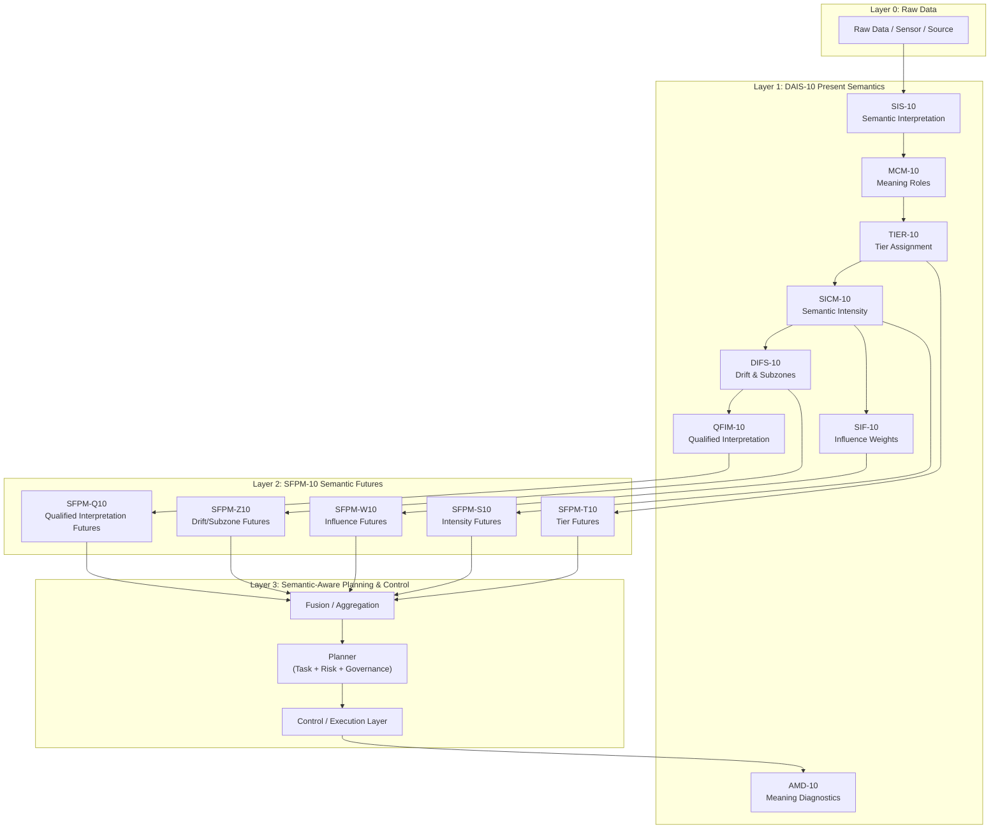

1. Conceptual stack: DAIS‑10 + SFPM‑10
Think of it as three semantic layers sitting between raw data and planning/control:

Layer A — Present Semantic Engine (DAIS‑10)

Layer B — Semantic Futures Engine (SFPM‑10)

Layer C — Semantic‑Aware Planning & Control

Layer A — DAIS‑10 (Present semantics)
This layer answers:
“What does this data mean right now?”

SIS‑10: Interpret raw attributes into semantic descriptors.

MCM‑10: Assign roles (MD, ME, MX, MN).

TIER‑10: Map roles to governance tiers (E, EC, C, CN, N).

SICM‑10: Convert tiers into a 0–100 intensity score.

SIF‑10: Assign normalized influence weights to attributes.

DIFS‑10: Assign drift/fading subzones based on score and time.

QFIM‑10: Produce a qualified interpretation level (Critical → Minimal).

AMD‑10: Diagnose semantic failures, contradictions, collapse.

Output of this layer per attribute a_i:

Present semantic state:  
x_i(t) = ( s_i(t), t_i(t), w_i(t), z_i(t), q_i(t) )

Layer B — SFPM‑10 (Semantic futures)
This layer answers:
“How will this meaning evolve over the next interval?”

Sub‑engines use x_i(t) and context:

SFPM‑S10: Forecast future intensity s_i(t + dt).

SFPM‑T10: Predict tier transitions t_i(t + dt).

SFPM‑W10: Adjust influence weights w_i(t + dt).

SFPM‑Z10: Update drift/fading subzone z_i(t + dt).

SFPM‑Q10: Update qualified interpretation q_i(t + dt).

Output per attribute:

Future semantic state:  
x_i(t + dt) = ( s_i(t + dt), t_i(t + dt), w_i(t + dt), z_i(t + dt), q_i(t + dt) )

Layer C — Semantic‑aware planning & control
This layer uses both present and future semantics:

Present state: “How serious / important is this right now?”

Future state: “Is this risk/intensity drifting into danger or fading out?”

So planning/control engines can:

Reprioritize: based on shifting influence and tiers.

Pre‑empt: actions before semantic failure (risk spike, drift threshold).

Stabilize: when futures show imminent meaning collapse.

Adapt: policies when futures show trends in context or signal quality.

2. Mermaid architecture diagram (combined DAIS‑10 + SFPM‑10)

3. Dataflow: from raw data to semantic futures
Step 1 — Raw data enters DAIS‑10
Input: raw attributes / fields / signals.

SIS‑10: interpret into semantic descriptors.

MCM‑10: assign roles (MD, ME, MX, MN).

TIER‑10: assign governance tiers (E, EC, C, CN, N).

SICM‑10: compute intensity score s_i(t).

SIF‑10: compute influence weight w_i(t).

DIFS‑10: assign drift/fading subzone z_i(t).

QFIM‑10: compute qualified level q_i(t).

AMD‑10: check for semantic failures at time t.

You now have present semantic state x_i(t).

Step 2 — DAIS‑10 state handed to SFPM‑10
For each attribute a_i, SFPM‑10 receives:

s_i(t) from SICM‑10

t_i(t) from TIER‑10

w_i(t) from SIF‑10

z_i(t) from DIFS‑10

q_i(t) from QFIM‑10

plus context over [t, t + dt] (policies, environment, patterns)

Step 3 — SFPM‑10 sub‑engines project semantic futures
SFPM‑S10: computes s_i(t + dt)

SFPM‑T10: computes t_i(t + dt)

SFPM‑W10: computes w_i(t + dt)

SFPM‑Z10: computes z_i(t + dt)

SFPM‑Q10: computes q_i(t + dt)

You now have future semantic state x_i(t + dt).

Step 4 — Planning and control use both present and future
Planning & control engines can now see:

Present: “How critical / influential is this attribute right now?”

Future: “Is this trending into danger, fading out, or becoming irrelevant?”

This enables:

Pre‑emptive governance: act before semantic collapse.

Drift‑aware decisions: adapt before drift breaks meaning.

Risk‑aware planning: prioritize attributes whose future semantics move toward Critical or High.

Stability decisions: hold, re‑plan, or stop based on semantic futures.
