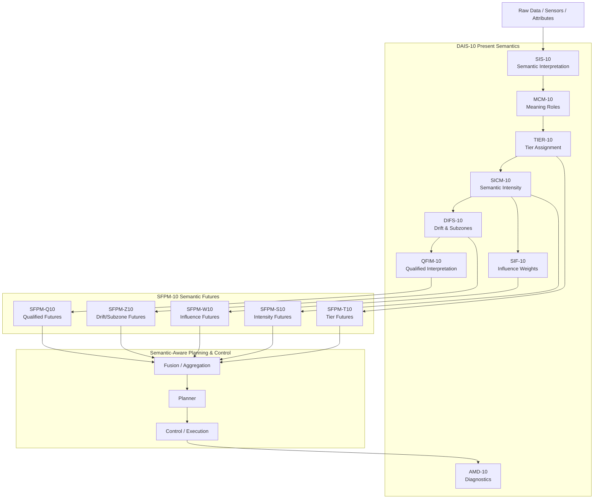
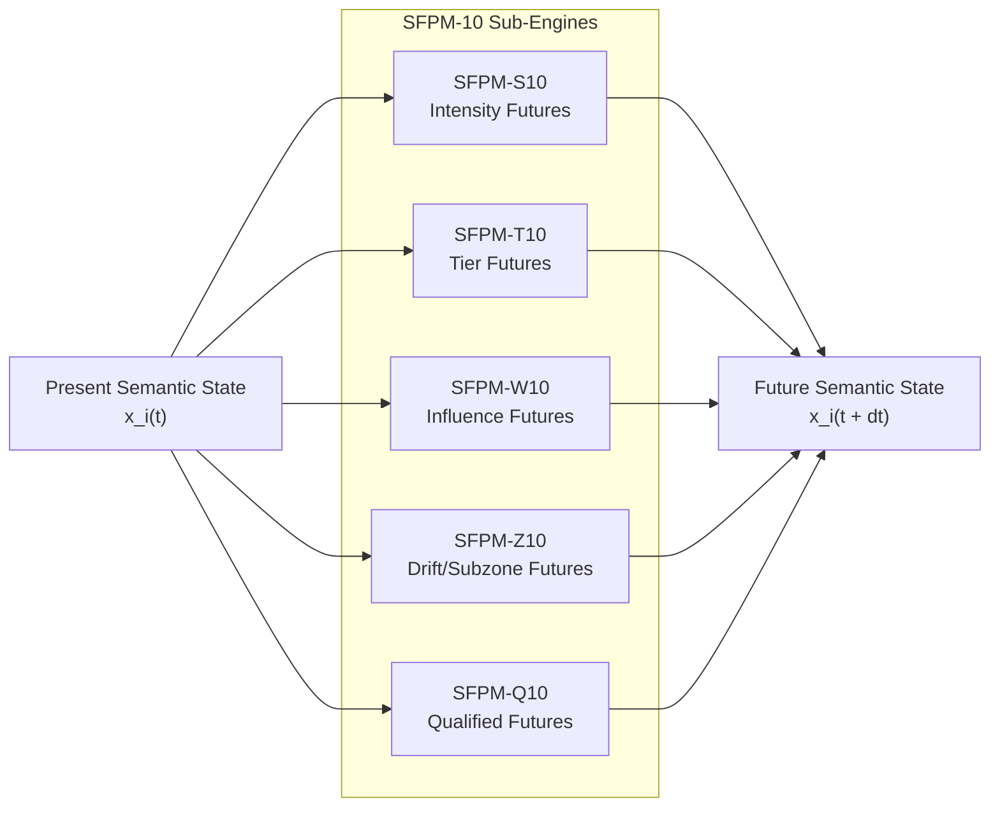
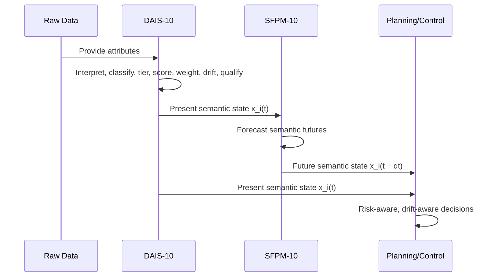

DAIS‑10 + SFPM‑10
Semantic Architecture for Present‑to‑Future Meaning Governance
DAIS‑10 is a semantic governance framework that transforms raw data into structured, tiered, influence‑weighted, drift‑aware, and diagnostically validated meaning.

SFPM‑10 extends DAIS‑10 by forecasting future semantic states, enabling systems to anticipate how meaning will evolve under changing context, drift, and governance rules.

Together, they form a unified architecture for present‑to‑future semantic intelligence.

1. High‑Level Architecture



2. DAIS‑10: Present Semantic Engine
DAIS‑10 transforms raw data into a structured semantic state.

mermaid
flowchart LR
    RAW["Raw Attribute"]
    SIS10["SIS‑10\nInterpretation"]
    MCM10["MCM‑10\nRole Assignment"]
    TIER10["TIER‑10\nTier Mapping"]
    SICM10["SICM‑10\nIntensity Score"]
    SIF10["SIF‑10\nInfluence Weight"]
    DIFS10["DIFS‑10\nDrift/Subzone"]
    QFIM10["QFIM‑10\nQualified Level"]
    AMD10["AMD‑10\nDiagnostics"]


    RAW --> SIS10 --> MCM10 --> TIER10 --> SICM10 --> DIFS10 --> QFIM10 --> AMD10
    SICM10 --> SIF10

DAIS‑10 Output (per attribute)
```Code
x_i(t) = ( s_i(t), t_i(t), w_i(t), z_i(t), q_i(t) )
Where:

s_i(t) = semantic intensity

t_i(t) = tier

w_i(t) = influence weight

z_i(t) = drift/fading subzone

q_i(t) = qualified interpretation
```
3. SFPM‑10: Semantic Futures Engine
SFPM‑10 forecasts how meaning will evolve over time.



SFPM‑10 Output (per attribute)
```Code
x_i(t + dt) = ( s_i(t+dt), t_i(t+dt), w_i(t+dt), z_i(t+dt), q_i(t+dt) )
```
4. Combined Semantic State Flow



5. Repository Structure
/dais10/
    sis10/
    sif10/
    mcm10/
    tier10/
    sicm10/
    difs10/
    qfim10/
    amd10/

/sfpm10/
    sfpm_s10/
    sfpm_t10/
    sfpm_w10/
    sfpm_z10/
    sfpm_q10/

/docs/
    diagrams/
    formulas/
    architecture/

/examples/
    robotics/
    semantic-futures/
    data-governance/
6. Key Features
Present Semantics (DAIS‑10)
Role classification

Tier governance

Influence weighting

Semantic intensity scoring

Drift & fading detection

Qualified interpretation

Semantic diagnostics

Future Semantics (SFPM‑10)
Intensity forecasting

Tier transition prediction

Influence evolution

Drift/subzone projection

Qualified interpretation futures

Planning & Control
Drift‑aware decisions

Pre‑emptive risk detection

Semantic stability management

Governance‑aligned planning

7. Why This Architecture Matters
DAIS‑10 + SFPM‑10 gives systems the ability to:

understand meaning now

anticipate meaning next

act with semantic foresight

maintain governance stability

detect drift before failure

prioritize based on future influence

This is semantic intelligence that spans present → future, not just static interpretation.

